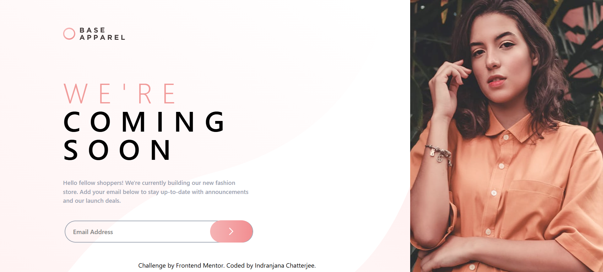

# Frontend Mentor - Base Apparel coming soon page solution

This is a solution to the [Base Apparel coming soon page challenge on Frontend Mentor](https://www.frontendmentor.io/challenges/base-apparel-coming-soon-page-5d46b47f8db8a7063f9331a0). Frontend Mentor challenges help you improve your coding skills by building realistic projects. 

## Overview

### Screenshot

### Links

- Solution URL: [solution URL](https://github.com/IndranjanaChatterjee/Base-Apparel-coming-soon-page)
- Live Site URL: [live site URL](https://social-proof-section-brown-three.vercel.app/)

### Built with

- Semantic HTML5 markup
- CSS custom properties
- Flexbox
- CSS Grid
- Mobile-first workflow
- [React](https://reactjs.org/) - JS library
- Tailwind CSS

## Author

- Website - [URL](https://www.indranjanachatterjee.me/)
- Frontend Mentor - [Indranjana Chatterjee](https://www.frontendmentor.io/profile/IndranjanaChatterjee)

